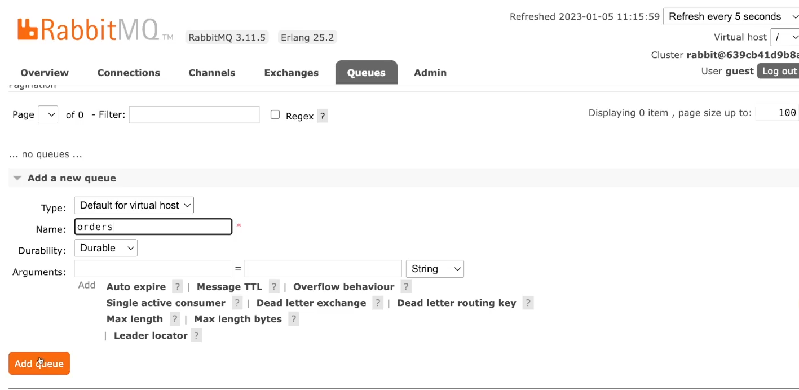
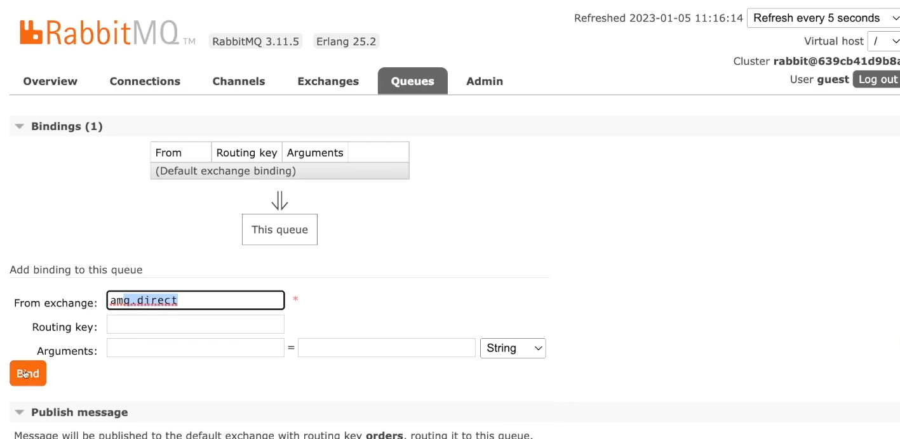

To initiate the application, use `docker compose up -d`

Now we should create the orders table in the database:

```bash
docker compose exec -it mysql bash
mysql -uroot -p orders
CREATE TABLE orders (id varchar(255) NOT NULL, price float NOT NULL, tax float NOT NULL, final_price float NOT NULL, PRIMARY KEY (id))
```

Finally, start the application by going to `./cmd/ordersystem/` and using `go run main.go wire_gen.go`.

Try inserting an order using the HTTP request below with curl in the Terminal: `curl -X POST http://localhost:8000/order -H "Content-Type: application/json" -d '{"id": "a","price": 100.5,"tax": 0.5}'`

Instead of using the curl command, you can also install the `REST Client` VSCode extension tool. Then, use the file inside `./api/create_order.http`
and execute that request from the file itself. You should get a 200 status code.

To test in GraphQL, just open `localhost:8080` and use the following mutation:

```graphql
mutation createOrder {
  createOrder(input: {id: "ccc", Price: 101, Tax: 0.5}) {
    id
    Price
    Tax
    FinalPrice
  }
}
```

Now to test that the message part with RabbitMQ works as well, we need to visit `localhost:15672` and follow the steps shown in
the figures below.




Basically, we created a new queue and added a binding with `amq.direct`. Now, if you execute the GraphQL mutation again and check
out the queue in the RabbitMQ management console, you will see one message in the queue, as it was expected.